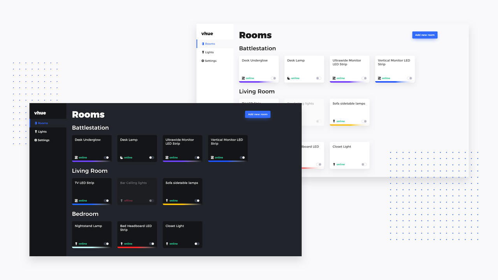

# vhue

A simple controller for Philips Hue lights made with Vue + Electron



## Features

Once you have connected to your local Hue bridge, you can do the following:

- Toggle lights on/off
- Adjust lights' brightness
- Add new lights/rooms
- Delete lights/rooms
- Edit lights/rooms attributes
- Enable global shortcut to toggle user selected lights

#### [Using the big switch to toggle my hue lights (gfycat)](https://giant.gfycat.com/ConsciousUniqueAegeancat.mp4)


## Build Setup

``` bash
# install dependencies
$ npm install

# or use yarn
$ yarn

# serve with hot reload at localhost:9080
$ npm run dev
# or
$ yarn run dev

# build electron application for production
$ npm run build

# build electron application for macos
$ npm run build:darwin

# lint all JS/Vue component files in `src/`
$ npm run lint

```

---

### License
[**MIT License**](LICENSE).

---

This project was generated with [electron-vue](https://github.com/SimulatedGREG/electron-vue)
